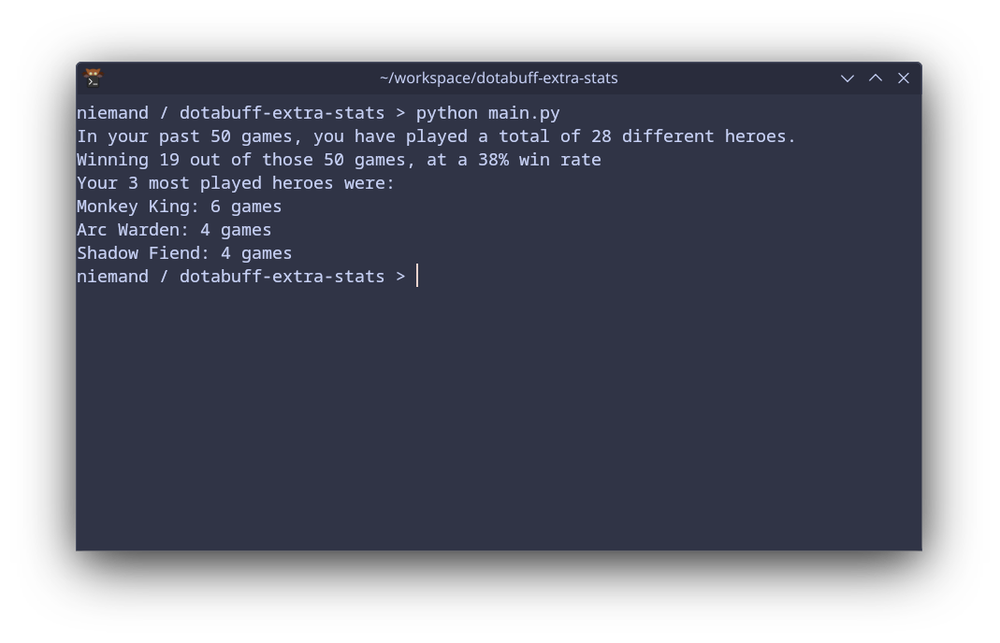

# Dotabuff matches summary

This script takes a dotabuff.com matches page from a players profile, and give a summary of stats at a quick glance.

It uses BeautifulSoup to scrape the page and some very basic pandas function to organize and view the information in a 2d table.

Most of the stats wil be based on the most recent 50 games(one page of matches).

Currently it looks like this:



## Dockerization

This project can be containerized using Docker for easy setup and execution. A Dockerfile is provided to build an image that includes Python and the required dependencies (requests, beautifulsoup4 and pandas). To build the image and run the container:

```docker build -t dotabuff-summary .```

```docker run --rm dotabuff-summary ```